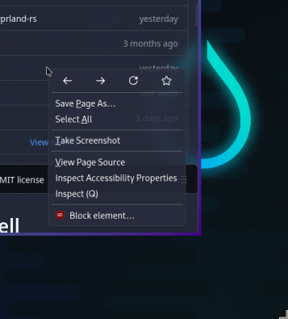
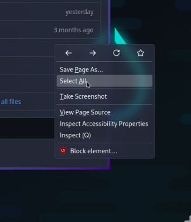

# Compositor Blur Behavior - Firefox Popups in Hyprland

## Issue Summary

Firefox popups exhibit inconsistent blur behavior in Hyprland compositor depending on their position relative to the Firefox window boundaries.

## Observed Behavior

### Contained Popups (No Blur)
When Firefox popups (context menus, dropdowns, etc.) are entirely contained within the Firefox window bounds:
- **No blur effect** is applied by the compositor
- Popups appear with transparency but without background blur
- May experience flickering/rendering artifacts during interaction

### Overflowing Popups (Blur Applied)
When any part of a Firefox popup extends beyond the Firefox window edge:
- **Full blur effect** is applied to the entire popup
- Proper compositor blur treatment as expected
- Reduced flickering and rendering issues

### Nested Popups (Always Blur)
Popups that spawn from other popups (popup-of-popup):
- **Consistently receive blur** regardless of position
- Treated as separate surfaces by the compositor

## Root Cause Analysis

The compositor appears to have different rendering pipelines for popup surfaces:
- **Contained popups**: Rendered as part of the main window surface → blur conflicts
- **Overflowing/nested popups**: Treated as independent surfaces → proper blur application

## Known Upstream Issue

This behavior is documented in Hyprland GitHub issue [#5333](https://github.com/hyprwm/Hyprland/issues/5333) "Firefox add-on pop up UI and Chromium flickering issues".

### User Reports
- "Reducing the height of the Firefox window to make the addon pop out of the window I don't see any flickering"
- Addon popup UI flickering when contained within window bounds
- Frame update delays requiring mouse movement to refresh

## Current Status

**Desired Outcome**: Consistent blur effects for all popups (both contained and overflowing) without rendering artifacts.

**Current Limitation**: Popups must extend beyond window boundaries to receive proper compositor blur treatment.

## Visual Examples

*Context menu entirely within Firefox window (no blur)*

*Context menu extending beyond Firefox window edge (blur applied)*

## Workarounds

### For Users
- Resize Firefox window to force popups to overflow for blur effect
- Window rules to disable blur: `windowrule = noblur,^(firefox)$`

### For Developers
- Monitor upstream Hyprland issue for compositor fixes
- Consider popup positioning strategies that favor overflow rendering

## Technical Details

- **Environment**: Hyprland compositor on Wayland
- **Affected Applications**: Firefox (primarily), some Chromium-based browsers
- **Compositor Version**: Affects multiple Hyprland versions
- **Impact**: Visual inconsistency and occasional rendering artifacts