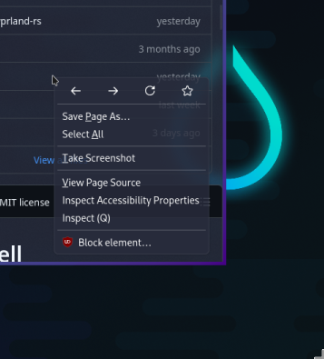
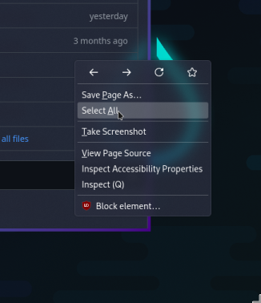

# Transparent Firefox Config

A Firefox userChrome.css configuration that creates a translucent, modern browser interface blending with your desktop background.


## Features

### Browser Interface
- **Translucent chrome**: Top bar, sidebar, and UI elements with semitransparent blue (`rgba(40, 44, 60, 0.80)`) 
- **Transparent dropdowns**: URL bar suggestions and hamburger menu with matching transparency
- **Clean visual hierarchy**: Consistent transparency layers throughout the interface
- **Desktop background blending**: Interface elements show the desktop background underneath

### Compositor Integration
- **Linux blur effects**: Works with compositing window managers like Hyprland to provide blur effects
- **Vertical sidebar support**: Native vertical tabs are properly blurred by the compositor
- **Cross-platform compatibility**: Should work on Windows/macOS but blur effects depend on compositor support
- **Limitation**: Internal Firefox surfaces (dropdowns, popups) cannot be blurred using CSS `backdrop-filter` or compositor features

## Installation

1. **Find your Firefox profile directory**:
   - Navigate to `about:support` in Firefox
   - Look for "Profile Folder" and click "Open Folder"

2. **Create chrome directory** (if it doesn't exist):
   ```bash
   mkdir chrome
   cd chrome
   ```

3. **Copy the file**:
   - Copy `userChrome.css` to the `chrome` directory

4. **Enable userChrome.css in Firefox**:
   - Go to `about:config`
   - Set `toolkit.legacyUserProfileCustomizations.stylesheets` to `true`
   - Set `browser.tabs.allow_transparent_browser` to `true`

5. **Restart Firefox** to see the changes

## Customization

### Transparency Level
Adjust the `--uc-a` variable in `:root` to change overall transparency:
```css
--uc-a: .80; /* 80% opacity, 20% transparent */
```

### Colors
Modify the color palette in the CSS variables:
```css
--uc-r: 40; --uc-g: 44; --uc-b: 60; /* RGB values for blue theme */
--uc-fg: #ffffff; /* Foreground text color */
```

## Compatibility

- **Platform**: Cross-platform (Linux, Windows, macOS)
- **Firefox Version**: Modern Firefox versions with userChrome.css support
- **Blur Effects**: Best experienced with Linux compositors like Hyprland that provide window transparency and blur
- **Limitations**: Firefox's internal popup surfaces cannot be blurred due to browser architecture

## Notes on Blur Effects

We attempted to blur Firefox's internal surfaces (dropdowns, menus) using:
- CSS `backdrop-filter` properties 
- Hyprland's blur popup settings
- Various CSS workarounds and pseudo-elements

However, Firefox's rendering architecture prevents these techniques from working on internal browser surfaces. The transparency effects work, but blur is limited to what the compositor can provide for the window as a whole.

### Compositor Blur Behavior

Interesting compositor behavior observed with popups:
- **Contained popups**: When Firefox popups are entirely within the Firefox window bounds, no blur is applied by the compositor
- **Overflowing popups**: If any part of a popup extends beyond the Firefox window edge, the compositor applies blur to the entire popup
- **Nested popups**: Popups that spawn from other popups (popup-of-popup) consistently receive compositor blur regardless of position

This suggests the compositor treats overflowing and nested popups as separate surfaces, while contained popups are rendered as part of the main window surface.

**Known Issue**: This behavior is documented in Hyprland GitHub issue [#5333](https://github.com/hyprwm/Hyprland/issues/5333) "Firefox add-on pop up UI and Chromium flickering issues". The issue confirms that contained popups experience rendering conflicts with blur effects, while overflowing popups render correctly with proper blur application.

**Desired Outcome**: Consistent blur effects for all popups (both contained and overflowing) without rendering artifacts. The current inconsistency requires popups to extend beyond window boundaries to receive proper compositor blur treatment.

**Visual Examples:**

Context menu entirely within Firefox window (no blur):


Context menu extending beyond Firefox window edge (blur applied):


## Contributing

Feel free to submit issues and pull requests for improvements.